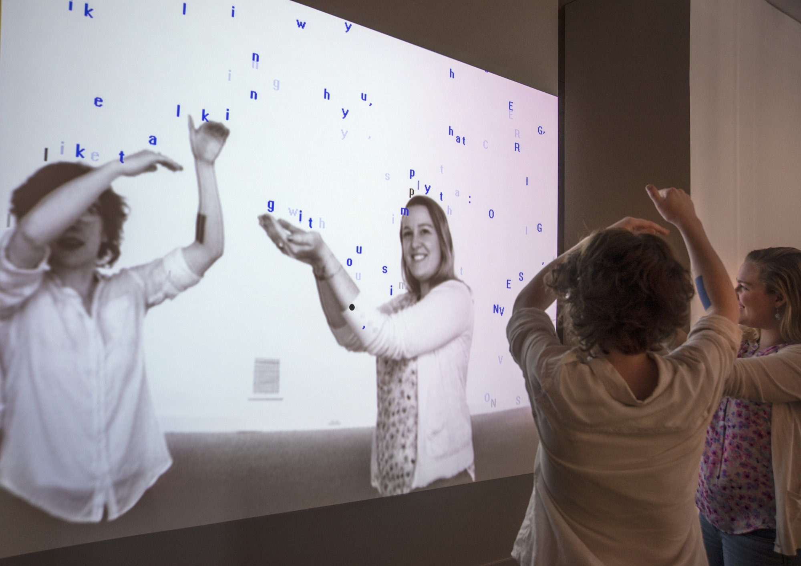
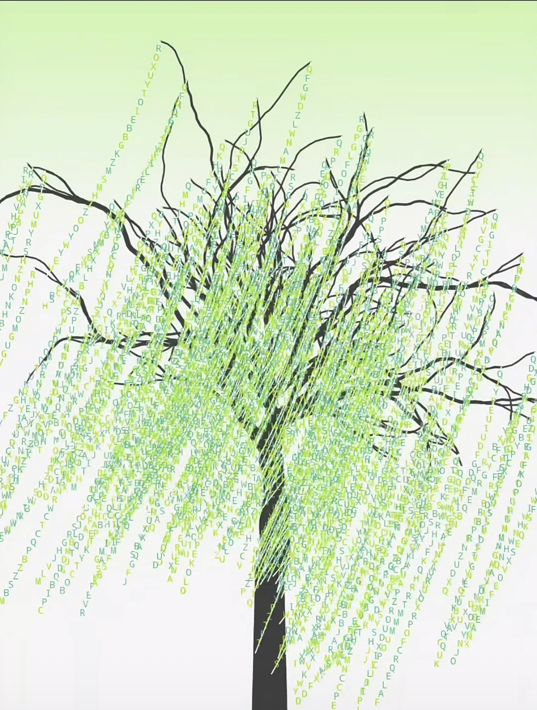
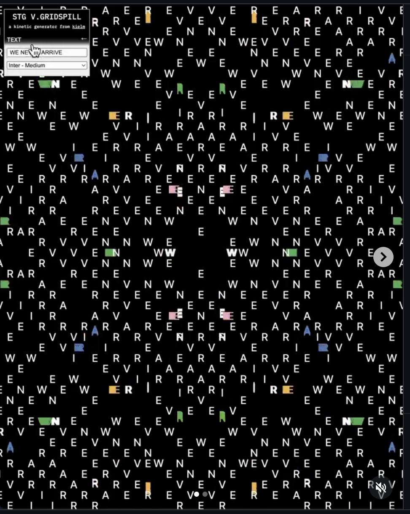
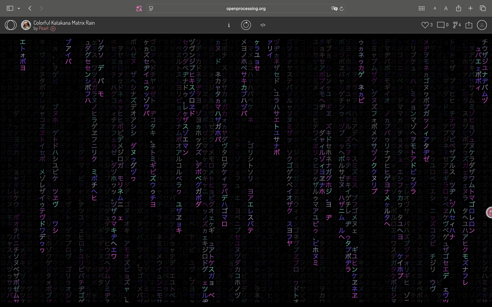
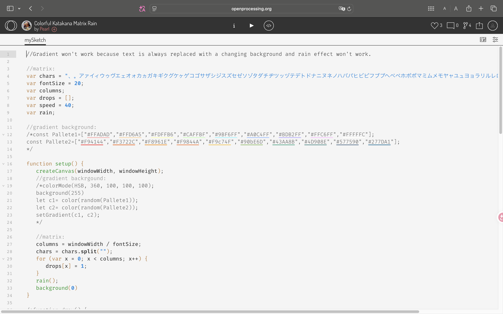

# IDEA9103_Week_8_Quiz
## Part 1: Imaging Technique Inspiration
The imaging technique I'm interested in is **Text-based Generative Art**. With that technique, letters and numbers lose their semantic meaning and become pure *visual particles* and *motion trails*. For our group assignment, we might choose a visual artwork. And in my part (*time-based mechanic*), I would like to make the image gradually fade into a text-based representation over time, abstracting the original artwork using characters we are familiar with. This technique would help me to create a contrast between the *familiar* and the *abstract*, viewers recognise the characters, while experiencing them as something entirely visual and new.

*Text Rain (1999) — Letters fall and rest on the viewer's silhouette, turning characters into interactive visual elements.*

*Text Willow by S.I.A — Characters replace leaves, forming a tree entirely out of letters.*

*GRIDSPILL by kielm — Input text is deconstructed and scattered across a kinetic grid.*

> Sources: [Text Rain – Smithsonian American Art Museum](https://americanart.si.edu/artwork/text-rain-109552) | [S.I.A on Xiaohongshu](http://xhslink.com/o/54MT4tu8hhP) | [GRIDSPILL by kielm](https://www.instagram.com/p/DUmBCR5jRM9/)

## Part 2: Coding Technique Exploration
I found two coding techniques that might be helpful:
1. **Pixel-to-character Mapping**, demonstrated by Daniel Shiffman in his *Coding Train Challenge #166*. It samples each pixel's brightness and replaces it with a corresponding character, forming a text-based version of the original image. 

*Coding Train Challenge #166: Image to ASCII — pixel brightness mapped to characters.*

2. **Class-based Particle System**, shown in the *Katakana Matrix Rain* sketch on OpenProcessing. It manages falling characters as individual objects with properties like speed and position. This approach uses concepts we have already explored, such as class structures, position and speed. Adapting the grid to render characters instead of colour blocks could achieve the text-based effect.

*Katakana Matrix Rain — class-based particle system with falling characters.*

*Source code of the Katakana Matrix Rain sketch.*

> Links: [Coding Train Challenge #166](https://thecodingtrain.com/challenges/166-image-to-ascii) | [Katakana Matrix Rain on OpenProcessing](https://openprocessing.org/sketch/1017917)